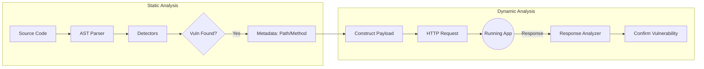

# How It Works: Static & Dynamic Analysis

This command-line tool combines **Static Application Security Testing (SAST)** and **Interactive Application Security Testing (IAST)** to detect mass assignment vulnerabilities in Spring Boot applications.

## 1. Static Analysis (SAST)

The static analysis phase reads your source code without executing it to find potential vulnerabilities.

### Step 1: File Discovery
- The tool recursively scans the provided directory.
- It looks for `.java` files (source code) and `.yml`/`.yaml` files (configuration).
- It ignores `node_modules`, `target`, `build`, and `.git` directories.

### Step 2: AST Parsing
- For every Java file, it uses `java-parser` to generate an **Abstract Syntax Tree (AST)**.
- The AST is a tree-like representation of the code structure (classes, methods, fields, annotations).
- **Fallback**: If AST parsing fails (e.g., due to syntax errors), it falls back to regex-based string matching.

### Step 3: Pattern Detection
The tool runs specific "Detectors" against the AST:

1.  **Entity detection**: Finds classes annotated with `@Entity`.
2.  **Lombok checks**: Checks if `@Data` or `@Setter` is used on those entities (which generates dangerous public setters).
3.  **Controller checks**: Finds `@RestController` classes.
    - Captures `@RequestMapping` paths (e.g., `/api/users`).
    - Looks for methods with `@PostMapping`, `@PutMapping`, `@PatchMapping`.
    - **Crucial Step**: It identifies methods that bind `@RequestBody` *directly* to an Entity class (instead of a DTO).
    - It extracts the **HTTP Method** (POST) and **Endpoint Path** (e.g., `/create`) for usage in Dynamic Analysis.

### Step 4: Metadata Extraction
- When a "Direct Entity Binding" vulnerability is found, the tool attaches metadata:
    - **Endpoint**: `/api/users/create`
    - **Method**: `POST`
    - **Entity Type**: `User`
- This metadata acts as the "bridge" to the dynamic analysis phase.

---

## 2. Dynamic Analysis (IAST)

If you provide the `--url` flag, the tool enters the dynamic phase using the metadata collected during the static phase.

### Step 1: Candidate Selection
- The scanner filters the list of static vulnerabilities.
- It uses only the **"Direct Entity Binding in Controller"** issues that have valid endpoint paths.

### Step 2: Payload Construction
- Based on the entity type (or generic heuristics), the tool constructs a malicious JSON payload designed to test mass assignment.
- **Goal**: Try to set sensitive fields that arguably shouldn't be set by a client.
- **Example Payload**:
    ```json
    {
      "isAdmin": true,
      "role": "ADMIN",
      "balance": 1000000,
      "id": 99999
    }
    ```

### Step 3: Interactive Probing
- It sends an HTTP request (using `axios`) to your running application URL + the extracted endpoint.
- Example: `POST http://localhost:8080/api/users/create`

### Step 4: Response Verification
- The tool analyzes the JSON response from your server.
- **Vulnerability Confirmation**: If the response contains the injected values (e.g., `"role": "ADMIN"` or `"isAdmin": true`), it confirms that the Mass Assignment attack was successful.
- **Safe**: If the sensitive fields are missing or the server returns an error, the vulnerability might be mitigated (or the endpoint requires authentication).

---

## Architecture Diagram


