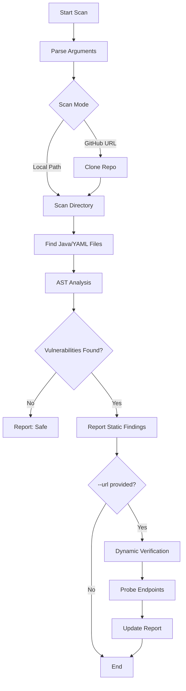

# SpringSecure CLI

A command-line tool for detecting mass assignment vulnerabilities in Spring Boot applications.

## Features

- 🔍 **AST-Based Analysis** - Uses java-parser for accurate Abstract Syntax Tree parsing
- 🎯 **10 Vulnerability Types** - Detects mass assignment vulnerabilities with CWE classifications
- 📊 **Multiple Output Formats** - Console, JSON, and text reports
- 🌐 **GitHub Repository Scanning** - Scan any public GitHub repository automatically
- 🚀 **Fast Scanning** - Recursively scan entire projects
- ⚡ **CI/CD Ready** - Exit codes for build pipeline integration
- 📝 **Detailed Recommendations** - Actionable fix instructions for each vulnerability
- 🔄 **Smart Fallback** - Automatic fallback to regex-based detection if AST parsing fails
- ⚡ **Dynamic Analysis** - Verify static findings against a running application instance

## Installation

```bash
npm install
```

## Usage

### Basic Scan

Scan current directory:
```bash
node cli.js
```

Scan a specific file:
```bash
node cli.js path/to/UserController.java
```

Scan a specific directory:
```bash
node cli.js path/to/spring-project
```

**Scan a GitHub repository:**
```bash
node cli.js https://github.com/username/spring-boot-project
```

### Dynamic Analysis (Interactive Mode)
Verify static findings by sending requests to your running application:
```bash
node cli.js ./src --url http://localhost:8080
```
*Note: This will attempt safe mass-assignment probes against detected endpoints.*

### Output Formats

**Console output (default):**
```bash
node cli.js src/
```

**JSON output:**
```bash
node cli.js src/ --json -o report.json
```

**Text output:**
```bash
node cli.js src/ --text -o report.txt
```

### Options

```
Usage: springsecure [options] [path]

Arguments:
  path                    File or directory to scan (default: ".")

Options:
  -V, --version          output the version number
  -o, --output <file>    Output file path for report
  -f, --format <type>    Output format: console, json, text (default: "console")
  -v, --verbose          Show detailed recommendations
  --json                 Output as JSON (shorthand for -f json)
  --text                 Output as text (shorthand for -f text)
  --fail-on-high         Exit with error code if high severity issues found
  --fail-on-medium       Exit with error code if medium+ severity issues found
  --url <url>            Base URL for dynamic analysis (e.g., http://localhost:8080)
  -h, --help             display help for command
```

### CI/CD Integration

Use `--fail-on-high` or `--fail-on-medium` to fail builds when vulnerabilities are detected:

```bash
# Fail build on high severity issues
node cli.js src/ --fail-on-high

# Fail build on medium or high severity issues
node cli.js src/ --fail-on-medium --json -o security-report.json
```

## Detected Vulnerabilities

### HIGH Severity

1. **Lombok @Data on Entity** (CWE-915)
   - Entity classes using `@Data` annotation
   - Generates public setters for all fields including sensitive ones

2. **Direct Entity Binding in Controller** (CWE-915)
   - Controllers binding `@RequestBody` directly to entity classes
   - Missing DTO layer protection

3. **Sensitive Field Without @JsonIgnore** (CWE-200)
   - Sensitive fields (password, token, secret) exposed in API responses
   - Missing @JsonIgnore annotation

4. **Public Setter on Sensitive Field** (CWE-915)
   - Public setters on fields like role, isAdmin, balance
   - Can be exploited via mass assignment

### MEDIUM Severity

5. **Unsafe Jackson Deserialization** (CWE-915)
   - `fail-on-unknown-properties: false` in configuration
   - Allows arbitrary property binding

6. **Missing Input Validation** (CWE-20)
   - `@RequestBody` without `@Valid` annotation
   - No validation on incoming data

7. **Lombok @Setter on Entity** (CWE-915)
   - Entity classes using `@Setter` annotation
   - May expose fields to mass assignment

8. **Dangerous JPA Cascade Configuration** (CWE-915)
   - Using `CascadeType.ALL` on relationships
   - Can lead to unintended data modifications

### LOW Severity

9. **Unsafe Orphan Removal** (CWE-915)
   - `orphanRemoval=true` without lifecycle callbacks
   - May lead to unintended deletions

10. **Permissive MVC Configuration** (CWE-755)
    - Silently ignoring missing handlers


## Workflow Diagram



## Examples

### Example 1: Scan with verbose output

```bash
node cli.js ./src --verbose
```

### Example 2: Generate JSON report for CI/CD

```bash
node cli.js ./src --json -o security-report.json --fail-on-high
```

### Example 3: Scan single file

```bash
node cli.js ./src/main/java/com/example/UserController.java -v
```

## Sample Output

```
═══════════════════════════════════════════════════════
  SpringSecure - Mass Assignment Vulnerability Scanner
═══════════════════════════════════════════════════════

🔍 Scanning: /path/to/project/src

Found 15 file(s) to analyze...

📄 src/main/java/com/example/User.java
   Found 2 issue(s): 1 HIGH 1 MEDIUM

   1. HIGH - Lombok @Data Exposure
      Line: 3
      Issue: Entity class uses @Data annotation which generates setters for all fields...
      Fix: Use @Getter and selective @Setter annotations instead.

───────────────────────────────────────────────────────
Summary:
  Total Files Scanned: 15
  Total Issues: 8
  ● High Severity: 3
  ● Medium Severity: 4
  ● Low Severity: 1
───────────────────────────────────────────────────────
```

## License

MIT

